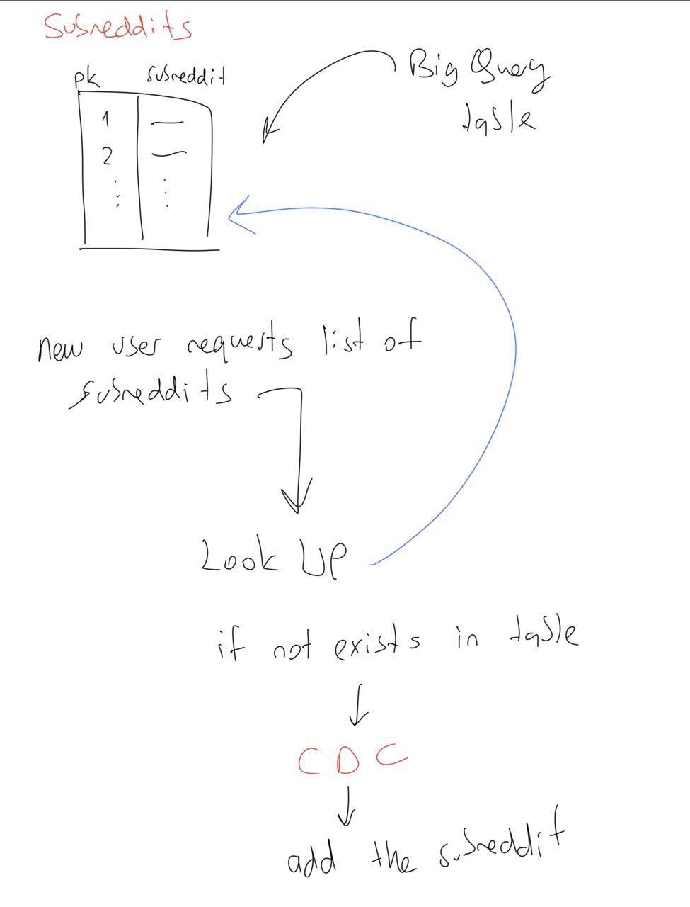

docker-compose -f docker-compose.dev.yaml exec django python soureddit/manage.py migrate    

Terraform Set up:
- change path to terraform folder
- terraform init
- terraform plan
- terraform apply

run these to initialize gcloud
- gcloud init
- process through terminal to activate the project

import all airflow dags into the google cloud storage by from summarizer folder:
- bash ./root/app/cloud/dags/airflow_setup.sh

! enable compute engine api on terraform
! vpc network peering has been used to connect the gcp with the mongodb atlas to use the mongodb database for the nodejs and django

to retrieve the secrets for google secret manager:
- create secret on gcp

install gcloud sdk on local machine
gcloud init -> to initialize the gcloud on local
this way the credentials will be retrieved from the gcp for mongodb connection from the imported modules

Expose Your Local Django Server:
Use ngrok (or a similar tool) to expose your local Django server to the public internet. Ngrok allows you to create a temporary public URL that redirects requests to your local server. Download and install ngrok from the official website (https://ngrok.com/).

Run ngrok on your terminal and specify the port on which your Django server is running:

bash
Copy code
ngrok http 8000  # Replace 8000 with the port number of your Django server
Ngrok will generate a public URL (e.g., https://randomstring.ngrok.io) that you can use to access your local Django server from the internet.

Share the Public URL with Your Friend:
Share the ngrok-generated public URL (e.g., https://randomstring.ngrok.io) with your friend. This URL will act as the base URL for your Django backend, allowing your friend's frontend to make API requests to your local Django server.